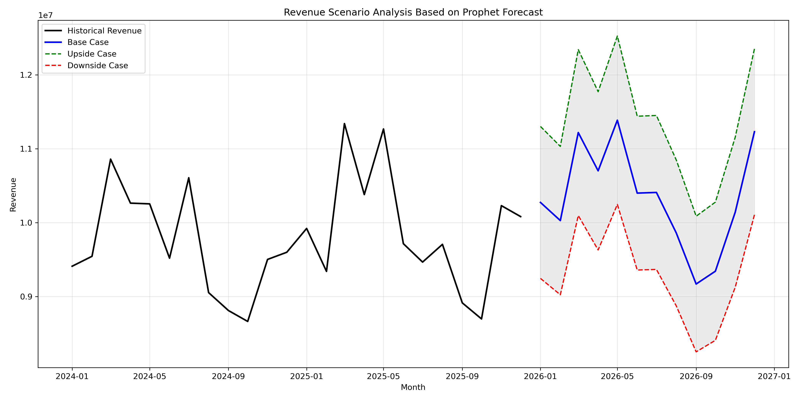

# Financial Analysis and Forecasting

This repository contains Python portfolio projects focused on financial analysis, forecasting, and business decision-making. The projects use realistic simulated datasets to demonstrate data cleaning, exploratory analysis, KPI development, forecasting, model comparison, and executive-level interpretation.

---

## Project 1: End-to-End Financial Analysis and Forecasting

The project analyzes revenue, profitability, budget variance, customer concentration, working capital, cash flow, and monthly revenue forecasting using  simulated company financial data to answer practical finance and FP&A questions.

- What drives revenue growth?
- Which products, regions, and channels are most profitable?
- Are discounts helping revenue or hurting margins?
- Where is the company beating or missing budget?
- How efficiently does the company convert sales into cash?
- Can monthly revenue be forecasted accurately?

### Summary of Results

- FY2025 performance showed approximately **$119.1M in revenue**, **$61.4M in gross profit**, and a **52% gross margin**.
- **Subscription** and **Data Platform** were the strongest product lines because they combined high revenue with high margins.
- **Hardware** generated meaningful revenue but had the weakest gross margin, making it a priority for pricing, cost, or supplier review.
- Higher discount levels were associated with weaker margins and higher return rates.
- All product lines finished below budget, with the largest shortfalls coming from Subscription and Data Platform.
- Customer concentration risk was low, while Enterprise customers generated the highest revenue per customer.
- Prophet produced the best monthly revenue forecasting performance and was used for the final forward forecast.

---

## Project 2: Energy Consumption Forecasting

This project forecasts hourly building energy consumption using **1,000 hourly observations**. The dataset includes temperature, humidity, square footage, occupancy, HVAC usage, lighting usage, renewable energy, holiday status, day of week, and energy consumption.

### Methods Used

- Hourly time-series preparation
- Daily aggregation and rolling averages
- Temperature and energy relationship analysis
- Stationarity testing
- Lag features for previous hour, same hour yesterday, and same hour last week
- Categorical encoding
- Random Forest forecasting
- Prophet forecasting
- Prophet with regressors
- Model comparison using MAE, RMSE, MAPE, and R²

### Summary of Results

- Energy consumption and temperature had a strong positive relationship, with a correlation of about **0.69**.
- The energy series was likely stationary based on the ADF test.
- The same-hour-yesterday baseline performed poorly, with a **MAPE of 11.82%** and a negative R².
- Plain Prophet improved on the baseline but performed weaker than models using external predictors.
- Prophet with regressors improved performance by adding weather, occupancy, and renewable energy variables.
- The **Improved Random Forest** model performed best, with approximately **5.24% MAPE** and **0.60 R²**.

The results suggest that hourly energy consumption is better predicted using weather, occupancy, building usage behavior, and lagged consumption than by simple time patterns alone.

---

## Tools Used

- Python
- Pandas
- NumPy
- Matplotlib
- Seaborn
- Plotly
- Scikit-learn
- Statsmodels
- Prophet
- Jupyter Notebook

---

## Skills Demonstrated

- Data cleaning and preprocessing
- Exploratory data analysis
- Financial KPI analysis
- Budget variance analysis
- Working capital analysis
- Time-series feature engineering
- Forecasting model comparison
- Machine learning regression
- Scenario analysis
- Business interpretation and reporting

---

## Why This Repository Matters

This repository demonstrates how Python can be used to solve practical finance, forecasting, and business analytics problems. The projects move from raw data to cleaned datasets, visual analysis, model comparison, and clear recommendations that are relevant for business growth.
